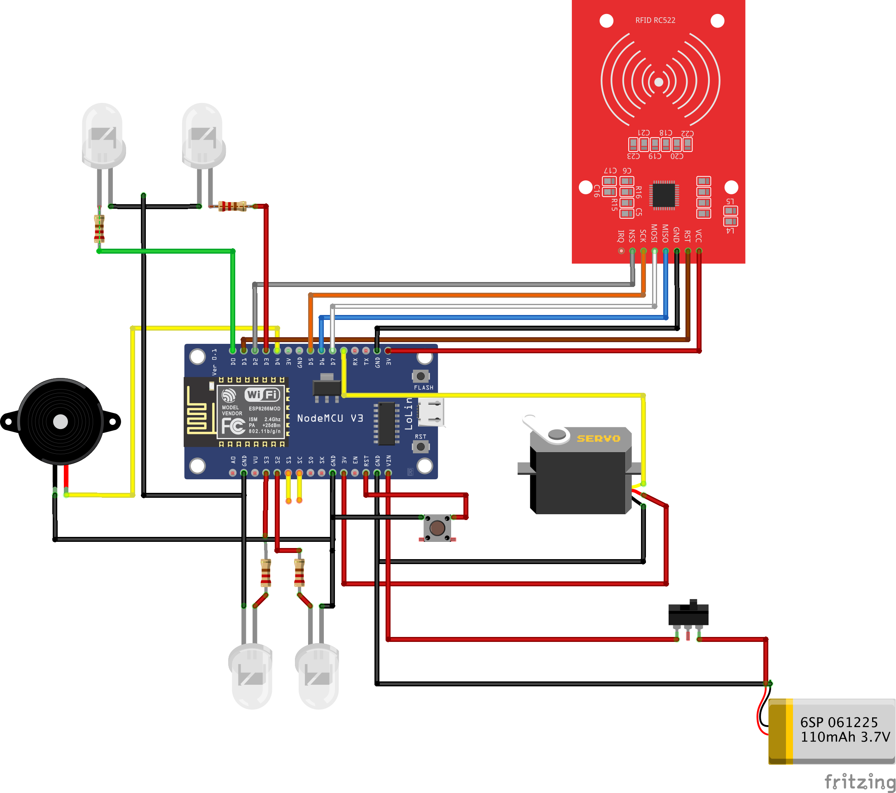

# Access Control System using ESP8266

## Table of Contents
- [Overview](#overview)
- [Features](#features)
- [Components Used](#components-used)
- [Circuit Diagram](#circuit-diagram)
- [How It Works](#how-it-works)
- [Technologies Used](#technologies-used)
- [Installation and Setup](#installation-and-setup)
- [Code Breakdown](#code-breakdown)
- [License](#license)

## Overview
This project is an **Access Control System** built using an **ESP8266 microcontroller**. The system utilizes **RFID technology** to read access cards, verifies the card credentials via a **server**, and **controls a servo motor** to unlock a door if authentication is successful. Additionally, **LED indicators and a buzzer** are used to provide status feedback.

## Features
- **RFID Authentication**: Uses the MFRC522 RFID reader.
- **Wi-Fi Connectivity**: ESP8266 connects to a remote server for authentication.
- **Servo Motor Control**: Unlocks the door upon successful authentication.
- **LED Indicators**: Displays status (Success, Error, Processing).
- **Buzzer Alerts**: Sounds alarms on access denial or successful authentication.
- **Real-time Logging**: Sends data to a server for access control monitoring.

## Components Used
- **ESP8266 NodeMCU** (Microcontroller)
- **MFRC522 RFID Module** (Card Reader)
- **SG90 Servo Motor** (Door Lock Mechanism)
- **LEDs** (Green and Red for status indication)
- **Buzzer** (Alerts for authentication status)
- **Power Supply** (5V for components)
- **Jumper Wires** (For connections)

## Circuit Diagram
Below is the circuit diagram for the access control system:



## How It Works
1. **Card Scanning**: The user presents an RFID card to the MFRC522 reader.
2. **Card Data Processing**: The ESP8266 reads the card's unique ID.
3. **Wi-Fi Communication**: The card ID is sent to a remote server via an HTTP request.
4. **Server Verification**: The server checks the card ID against a database.
5. **Access Decision**:
   - If the card is **valid**, the **servo motor rotates 45°** to unlock the door.
   - If the card is **invalid**, the **buzzer sounds an alarm** and the red LED blinks.
6. **Logging**: The server logs each access attempt for security tracking.

## Technologies Used
- **Microcontroller**: ESP8266 NodeMCU
- **Programming Language**: C++ (Arduino IDE)
- **Server Communication**: HTTP requests (REST API)
- **Database**: MySQL (for access control management)
- **Power Supply**: 5V

## Installation and Setup
### 1. Hardware Setup
- Connect the **RFID Module (MFRC522)** to ESP8266 as per the circuit diagram.
- Attach the **SG90 Servo Motor** to the door locking mechanism.
- Connect **LEDs and Buzzer** to the appropriate GPIO pins.

### 2. Software Setup
#### a) Install Required Libraries in Arduino IDE
- **MFRC522 Library** (`MFRC522.h`)
- **ESP8266WiFi Library** (`ESP8266WiFi.h`)
- **ArduinoJson Library** (`ArduinoJson.h`)
- **Servo Library** (`Servo.h`)
- **ESP8266HTTPClient Library** (`ESP8266HTTPClient.h`)

#### b) Configure WiFi and Server
Modify the following lines in the Arduino code with your credentials:
```cpp
const char* ssid = "Your_WiFi_Name";        
const char* password = "Your_WiFi_Password";
const char* serverUrl = "http://your-server-url.com/api/verify";
```

### 3. Upload Code to ESP8266
- Connect ESP8266 to your computer via USB.
- Open **Arduino IDE** and select **NodeMCU 1.0 (ESP-12E Module)** as the board.
- Upload the sketch to ESP8266.

## Code Breakdown
### 1. WiFi Connection
```cpp
WiFi.begin(ssid, password);
while (WiFi.status() != WL_CONNECTED) {
    delay(500);
    Serial.print(".");
}
Serial.println("WiFi Connected!");
```
### 2. Reading RFID Card
```cpp
if (!rfid.PICC_IsNewCardPresent() || !rfid.PICC_ReadCardSerial()) {
    return;
}
```
### 3. Sending Data to Server
```cpp
HTTPClient http;
http.begin(client, serverUrl);
http.addHeader("Content-Type", "application/json");
String payload = "{\"cardID\": \"" + cardID + "\"}";
int httpResponseCode = http.POST(payload);
```
### 4. Servo Motor Control
```cpp
myServo.write(45);  // Unlock Door
delay(5000);
myServo.write(0);   // Lock Again
```

## License
This project is licensed under the MIT License. You are free to use, modify, and distribute the code.

---
### Developed by: [Tamimu Said Rashid]  
#### Contact: [rashidytamimu@gmail.com]


